# Grout Shader: tile / texture mill

Seamless tile textures written as GLSL shaders. Every style lives in [`src/shader/catalog.ts`](src/shader/catalog.ts), gets judged in the shader, and is then baked to PNG. The baked corpus is committed under [`public/textures/`](public/textures/) and shown in a [GitHub Pages gallery](https://shoozes.github.io/mountain-cabin-bloom-honey/gallery/).

## Hero grid

Twelve baked PNGs (256×256, seed 1204, palette `style`). Pixel tiles are drawn at width 128 and may look soft if GitHub strips `image-rendering`.

<table>
  <tr>
    <td align="center">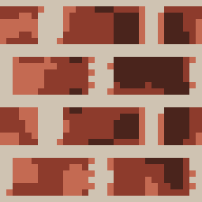<br><sub>Running Bond · pixel</sub></td>
    <td align="center">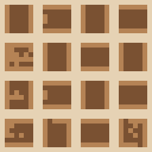<br><sub>Herringbone · pixel</sub></td>
    <td align="center">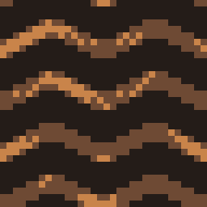<br><sub>Chevron · pixel</sub></td>
    <td align="center">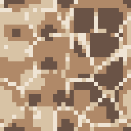<br><sub>Buttered Grout · pixel</sub></td>
  </tr>
  <tr>
    <td align="center">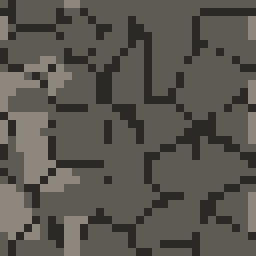<br><sub>Cobble · pixel</sub></td>
    <td align="center">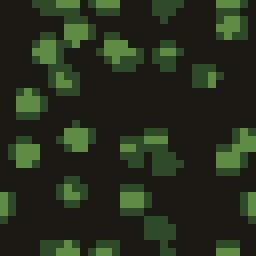<br><sub>Moss Clumps · pixel</sub></td>
    <td align="center">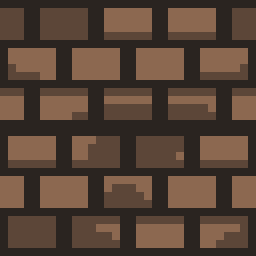<br><sub>Shingles · pixel</sub></td>
    <td align="center">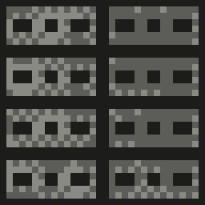<br><sub>Cinder Block · pixel</sub></td>
  </tr>
  <tr>
    <td align="center">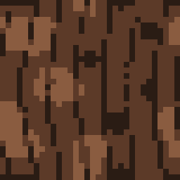<br><sub>Bark · pixel</sub></td>
    <td align="center">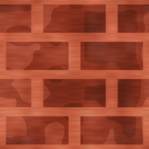<br><sub>Running Bond · painted</sub></td>
    <td align="center">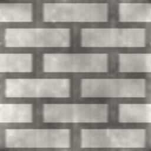<br><sub>Subway Tile · real</sub></td>
    <td align="center">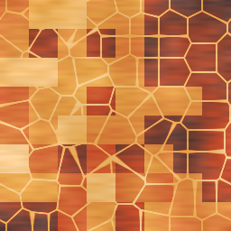<br><sub>Tessera · painted</sub></td>
  </tr>
</table>

## Style tranches

The catalog has 75 styles. Verdicts come from [`docs/look-dev/catalog-keep-cut.md`](docs/look-dev/catalog-keep-cut.md):

| Category | keep | needs-ref | cut | total |
| --- | ---: | ---: | ---: | ---: |
| Reviewed | 7 | 2 | 0 | 9 |
| Bond | 10 | 0 | 0 | 10 |
| Ground | 11 | 0 | 0 | 11 |
| Built | 10 | 0 | 0 | 10 |
| Fiber | 5 | 10 | 0 | 15 |
| Metal | 4 | 5 | 0 | 9 |
| Nature | 2 | 9 | 0 | 11 |
| **Total** | **49** | **26** | **0** | **75** |

- **keep**: stays in the catalog and has a judge reference mapping.
- **needs-ref**: stays in the catalog but still needs a `JUDGE_REFS` entry. It is not published as a corpus PNG.
- **cut**: removed from the catalog. Ten Signal/FX and hazard styles were already removed, so none are pending.

Each style can render in four looks (`LOOKS` in `catalog.ts`). The look is applied in the shader's `finish()` pass in [`src/shader/glsl.ts`](src/shader/glsl.ts):

| Look | Label | What the shader does |
| --- | --- | --- |
| `pixel` | Pixel art | Chunk grid (default 32), 4×4 Bayer ordered dither, snapped to the palette's 4 colors |
| `painted` | Painted | Luma remapped through the palette with brush dab and bristle noise, warm tint |
| `real` | Hyper real | FBM shading plus micro detail and pore highlights |
| `poster` | Poster | Luma posterized to 3 bands through the palette |

The non-pixel looks render smooth (chunk grid 0) and add grain that scales with wear.

## Fetching textures

The corpus has a pixel PNG for each of the 49 keep styles. Four heroes (brick, stone, subway, mosaic) also have painted, real, and poster versions. That makes 61 files.

**Gallery.** Browse, filter, and preview tiles at https://shoozes.github.io/mountain-cabin-bloom-honey/gallery/

**Manifest.** [`public/textures/manifest.json`](public/textures/manifest.json), also served at https://shoozes.github.io/mountain-cabin-bloom-honey/textures/manifest.json

- `format`: `grout-corpus/1`
- `sourceTip`: the commit the bake was drawn from
- `files[]`: one entry per PNG with `id`, `name`, `category`, `look`, `pixels`, `exportSize`, `palette`, `seed`, `scale`, `wear`, `repeat`, `path`

`path` is relative to `public/`, so it is also the URL path under the Pages site.

**Raw PNGs.**

| Host | Pattern | Example |
| --- | --- | --- |
| GitHub Pages | `https://shoozes.github.io/mountain-cabin-bloom-honey/textures/<look>/<category>/<id>.png` | https://shoozes.github.io/mountain-cabin-bloom-honey/textures/pixel/bond/herringbone.png |
| raw GitHub | `https://raw.githubusercontent.com/Shoozes/mountain-cabin-bloom-honey/main/public/textures/<look>/<category>/<id>.png` | https://raw.githubusercontent.com/Shoozes/mountain-cabin-bloom-honey/main/public/textures/pixel/bond/herringbone.png |

`<category>` is lowercase (`reviewed`, `bond`, `ground`, `built`, `fiber`, `metal`, `nature`). Raw GitHub URLs follow whatever `main` holds. Pin a commit SHA instead of `main` if you need the same bytes every time.

```sh
curl -sO https://shoozes.github.io/mountain-cabin-bloom-honey/textures/manifest.json
curl -sO https://shoozes.github.io/mountain-cabin-bloom-honey/textures/pixel/bond/herringbone.png
```

## Shader first, bake only

1. **Author in GLSL.** Styles are shader code in the catalog (`src/shader/catalog.ts`, `src/shader/glsl.ts`), and look-dev reviews them live in the mill.
2. **Judge in the shader.** The pass/fail gate is `SEAM_MAX` (0.16) and `MATCH_MIN` (0.58) in [`src/shader/judge.ts`](src/shader/judge.ts). Seam scoring is in [`src/shader/seam.ts`](src/shader/seam.ts). `npm run seam` ([`scripts/seam-harness.mjs`](scripts/seam-harness.mjs)) and `npm test` check it.
3. **Bake, never paint.** `npm run bake:corpus` ([`scripts/bake-corpus.mjs`](scripts/bake-corpus.mjs)) uses headless Chromium (Playwright) to draw each tile with the same path the mill's Save / PNG catalog export uses. It uses a locked recipe (`RECIPE` in the script) and writes `public/textures/**` and `manifest.json`. The bake refuses held needs-ref ids (`HELD_IDS`). PNGs are only ever shader output. Nobody edits them by hand.
4. **Provenance.** The bake writes `sourceTip` into the manifest. That value is `BAKE_SOURCE_TIP` if set, otherwise `git rev-parse origin/main`. After a shader or recipe change, re-bake and commit the PNGs.
5. **Deploy.** [`.github/workflows/pages.yml`](.github/workflows/pages.yml) runs `npm run build:pages` on every push to `main`. It never bakes. It ships the committed PNGs as-is. The bake is not part of `npm run build` either.

The hosting plan and recipe are in [`docs/look-dev/public-publish-png-plan.md`](docs/look-dev/public-publish-png-plan.md).

## Planned (not yet available)

> **Planned.** None of these exist yet. There are no commands, endpoints, or packages to use today.

- **CLI** to fetch a texture
- **HTTP API** that returns a PNG or its shader recipe
- **MCP server** that exposes the corpus to agents

The publish plan says these should read `manifest.json` and the `textures/` tree rather than re-implement export.

## Development

Requires Node 22 (`@tanstack/react-start` needs >= 22.12).

```sh
npm install
npm run dev            # mill + gallery on http://localhost:8080
npm test               # node tests, including src/shader/seam.test.ts
npm run seam           # seam / match harness
npm run typecheck
npm run lint
npm run build:pages    # static Pages build (base /mountain-cabin-bloom-honey/) into dist/client
npm run preview:pages
npm run bake:corpus    # re-bake public/textures (needs Playwright Chromium)
```

Routes: `/` is the mill (live shader, Save, 2×2 atlas, PNG catalog ZIP). `/gallery` is the baked PNG gallery.
